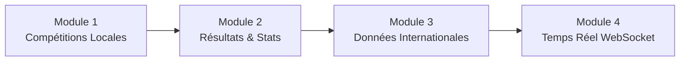

# 🏊 Gestion des Compétitions, Résultats Internationaux & Temps Réel

## Contexte

Le projet **Aquapulse / Mission** est une application Spring Boot 3.2 + Angular 21 de gestion de club de natation. Il possède déjà des entités `Competition`, `Epreuve`, `Resultat` avec un CRUD basique, mais le frontend de la page **Résultats** est statique (données en dur dans le HTML) et il n'y a aucune intégration avec des données internationales.

---

## Analyse de Faisabilité

### ✅ Ce qui est FAISABLE

| Fonctionnalité | Faisabilité | Approche |
|---|---|---|
| Gestion complète des compétitions locales (CRUD) | ✅ 100% | Enrichir les entités existantes + nouvelles pages Angular |
| Résultats & classements des compétitions | ✅ 100% | Connecter le frontend au backend API existant |
| Statistiques & graphiques des nageurs | ✅ 100% | Nouveaux endpoints + Chart.js (déjà utilisé) |
| Données internationales (records mondiaux, résultats) | ✅ Faisable | **Scraping** du site World Aquatics (pas d'API gratuite) |
| Profils des grands nageurs internationaux | ✅ Faisable | Scraping + base de données statique pré-remplie |
| Résultats en temps réel via graphique/tableau | ✅ Faisable | **WebSocket** (Spring Boot → Angular) |

### ⚠️ Limitations importantes

| Fonctionnalité | Statut | Raison |
|---|---|---|
| Regarder des matchs de natation en **live streaming vidéo** | ❌ **Impossible** | Pas d'API gratuite de streaming. Les droits vidéo sont détenus par les fédérations/diffuseurs (Olympic Channel, Eurosport...). On ne peut pas les intégrer légalement. |
| API officielle World Aquatics (FINA) | ❌ N'existe pas | World Aquatics n'offre **aucune API publique gratuite**. Il faut faire du scraping ou utiliser des données statiques. |
| Données en temps réel des compétitions internationales | ⚠️ Partiel | Pas de source temps réel gratuite. On peut **simuler** du temps réel pour les compétitions du club via WebSocket. |

> [!IMPORTANT]
> **Streaming vidéo live** : Il n'existe aucune API gratuite ni légale permettant d'intégrer du streaming vidéo de natation en direct. La meilleure alternative est de fournir des **liens vers les diffusions officielles** (YouTube World Aquatics, Olympic Channel) et d'afficher des **résultats en temps réel** pour les compétitions de votre propre club via WebSocket.

---

## Proposition : 4 Modules à Développer

---

## Module 1 — Gestion Complète des Compétitions Locales

Enrichir le modèle `Competition` existant et créer des pages Angular complètes.

### Backend

#### [MODIFY] [Competition.java](file:///c:/Users/atiya/mission/mission/src/main/java/com/projectmission/model/Competition.java)
Ajouter les champs : `nom`, `lieu`, `dateDebut`, `dateFin`, `type` (CHAMPIONNAT, COUPE, MEETING), `statut` (A_VENIR, EN_COURS, TERMINE), `niveau` (LOCAL, REGIONAL, NATIONAL), `organisateur`, `description`.

#### [MODIFY] [CompetitionDTO.java](file:///c:/Users/atiya/mission/mission/src/main/java/com/projectmission/dto/CompetitionDTO.java)
Ajouter les mêmes champs au DTO.

#### [MODIFY] [CompetitionService.java](file:///c:/Users/atiya/mission/mission/src/main/java/com/projectmission/service/CompetitionService.java)
Ajouter filtrage par statut, date, type. Ajouter méthode `getCompetitionsEnCours()`.

#### [MODIFY] [CompetitionController.java](file:///c:/Users/atiya/mission/mission/src/main/java/com/projectmission/controller/CompetitionController.java)
Ajouter endpoints : `GET /api/competitions/en-cours`, `GET /api/competitions/a-venir`, `GET /api/competitions?type=X&statut=Y`.

### Frontend

#### [NEW] `frontend/src/app/pages/admin/competitions/competitions.component.ts`
#### [NEW] `frontend/src/app/pages/admin/competitions/competitions.component.html`
Page CRUD complète avec : liste des compétitions en cards, formulaire modal d'ajout/édition, filtres par type/statut/année, badges de statut colorés.

#### [NEW] `frontend/src/app/core/services/competition.service.ts`
Service Angular pour les appels API compétitions.

#### [MODIFY] [app.routes.ts](file:///c:/Users/atiya/mission/frontend/src/app/app.routes.ts)
Ajouter route `competitions`.

#### [MODIFY] [admin-shell.component.html](file:///c:/Users/atiya/mission/frontend/src/app/layout/admin-shell/admin-shell.component.html)
Ajouter lien « Compétitions » dans la navbar.

---

## Module 2 — Résultats & Statistiques

Connecter la page Résultats au backend et ajouter des visualisations statistiques.

### Backend

#### [MODIFY] [Resultat.java](file:///c:/Users/atiya/mission/mission/src/main/java/com/projectmission/model/Resultat.java)
Ajouter : `points`, `record` (boolean), `dateCompetition`.

#### [MODIFY] [ResultatDTO.java](file:///c:/Users/atiya/mission/mission/src/main/java/com/projectmission/dto/ResultatDTO.java)
Enrichir avec noms du nageur et de l'épreuve (pour l'affichage), nom de la compétition.

#### [NEW] `StatistiqueDTO.java`
DTO pour les statistiques agrégées : meilleur temps par épreuve, évolution des performances, nombre de médailles, etc.

#### [MODIFY] [ResultatController.java](file:///c:/Users/atiya/mission/mission/src/main/java/com/projectmission/controller/ResultatController.java)
Ajouter : `GET /api/resultats/competition/{id}`, `GET /api/resultats/nageur/{id}`, `GET /api/resultats/statistiques`.

#### [NEW] `StatistiqueService.java`
Service pour calculer : progression d'un nageur, classement par épreuve, records du club, répartition des médailles.

### Frontend

#### [MODIFY] [resultats.component.ts](file:///c:/Users/atiya/mission/frontend/src/app/pages/admin/resultats/resultats.component.ts)
#### [MODIFY] [resultats.component.html](file:///c:/Users/atiya/mission/frontend/src/app/pages/admin/resultats/resultats.component.html)
Remplacer les données en dur par des appels API dynamiques. Ajouter un tableau de résultats triable, des graphiques d'évolution (Chart.js), et des filtres.

#### [NEW] `frontend/src/app/pages/admin/statistiques/statistiques.component.ts`
#### [NEW] `frontend/src/app/pages/admin/statistiques/statistiques.component.html`
Page dédiée avec : graphiques de progression, top performances, comparaison entre nageurs, records du club.

---

## Module 3 — Données Internationales (Scraping)

Scraping du site **worldaquatics.com** pour récupérer les records mondiaux et les résultats des grandes compétitions.

> [!WARNING]
> Le scraping de worldaquatics.com est soumis à leurs conditions d'utilisation. Pour un projet universitaire, c'est généralement acceptable. Pour une mise en production, il faudrait envisager une source de données sous licence.

### Backend

#### [NEW] `model/RecordMondial.java`
Entity pour stocker les records mondiaux : épreuve, temps, nageur, nationalité, date, bassin (25m/50m), catégorie (H/F).

#### [NEW] `model/NageurInternational.java`
Entity : nom, nationalité, palmarès, photo URL, spécialités, records personnels.

#### [NEW] `model/CompetitionInternationale.java`
Entity : nom, lieu, dates, type (Mondiaux, JO, Coupe du Monde...), résultats principaux.

#### [NEW] `service/WorldAquaticsScrapingService.java`
Service utilisant **Jsoup** pour scraper :
- Records mondiaux actuels (Long/Short Course, Hommes/Femmes)
- Résultats des dernières grandes compétitions
- Profils des grands nageurs

Le scraping sera exécuté via un **@Scheduled** (1 fois par jour) pour mettre à jour la base locale.

#### [NEW] `controller/InternationalController.java`
Endpoints : `GET /api/international/records`, `GET /api/international/competitions`, `GET /api/international/nageurs`, `GET /api/international/nageurs/{id}`.

#### [MODIFY] [pom.xml](file:///c:/Users/atiya/mission/mission/pom.xml)
Ajouter la dépendance **Jsoup** pour le scraping HTML.

### Frontend

#### [NEW] `frontend/src/app/pages/admin/international/international.component.ts`
#### [NEW] `frontend/src/app/pages/admin/international/international.component.html`
Page avec onglets :
- **Records Mondiaux** : tableau filtrable par épreuve, sexe, bassin
- **Grandes Compétitions** : timeline des événements majeurs avec résultats
- **Grands Nageurs** : cards avec profils, records, médailles
- **Liens Live** : liens vers les streams officiels (YouTube World Aquatics, etc.)

#### [NEW] `frontend/src/app/core/services/international.service.ts`
Service pour les appels API internationaux.

---

## Module 4 — Résultats en Temps Réel (WebSocket)

Permettre à un coach/admin de saisir des résultats pendant une compétition, et à tous les utilisateurs de suivre en temps réel via un tableau/graphique.

### Backend

#### [MODIFY] [pom.xml](file:///c:/Users/atiya/mission/mission/pom.xml)
Ajouter `spring-boot-starter-websocket`.

#### [NEW] `config/WebSocketConfig.java`
Configuration STOMP WebSocket avec endpoint `/ws` et topic `/topic/competition/{id}`.

#### [NEW] `controller/LiveResultController.java`
Controller WebSocket pour broadcaster les résultats en temps réel. REST endpoint pour que le coach poste un résultat → le serveur broadcast à tous les abonnés.

#### [NEW] `dto/LiveResultEvent.java`
DTO pour les événements temps réel : nageur, épreuve, temps, classement provisoire, timestamp.

### Frontend

#### [NEW] `frontend/src/app/pages/admin/live/live.component.ts`
#### [NEW] `frontend/src/app/pages/admin/live/live.component.html`
Page « Suivi en Direct » avec :
- **Tableau scoreboard** auto-mis à jour via WebSocket
- **Graphique** en temps réel (Chart.js) montrant l'évolution des classements
- Indicateur « EN DIRECT 🔴 » animé
- Sélection de la compétition active
- Pour les coachs : formulaire rapide de saisie de résultat

#### [NEW] `frontend/src/app/core/services/live.service.ts`
Service WebSocket Angular utilisant **@stomp/stompjs** et **SockJS**.

---

## Résumé des technologies à ajouter

| Technologie | Usage | Côté |
|---|---|---|
| **Jsoup 1.17+** | Scraping World Aquatics | Backend (pom.xml) |
| **spring-boot-starter-websocket** | WebSocket STOMP | Backend (pom.xml) |
| **@stomp/stompjs** + **sockjs-client** | Client WebSocket | Frontend (npm) |
| **Chart.js** (déjà présent) | Graphiques stats & live | Frontend |

---

## Open Questions

> [!IMPORTANT]
> 1. **Scope du scraping** : Veux-tu scraper uniquement les records mondiaux, ou aussi les résultats détaillés des compétitions (cela augmente la complexité) ?
> 2. **WebSocket — qui saisit ?** : Est-ce que seul l'admin/coach saisit les résultats en direct, ou veux-tu aussi un mode "simulation" avec des données fictives pour la démo ?
> 3. **Priorité** : Dans quel ordre veux-tu que j'implémente les modules ? Je propose : Module 1 → Module 2 → Module 3 → Module 4.
> 4. **Données de démo** : Veux-tu que je pré-remplisse la base avec des données fictives de compétitions et résultats pour la démo ?

---

## Verification Plan

### Automated Tests
- `mvn test` — vérifier que le backend compile et les tests passent
- `ng build` — vérifier que le frontend compile sans erreurs

### Manual Verification
- Naviguer sur chaque nouvelle page et vérifier l'affichage
- Tester le CRUD compétitions
- Vérifier que le scraping remplit la base de données
- Tester le WebSocket en ouvrant 2 onglets et en saisissant un résultat
